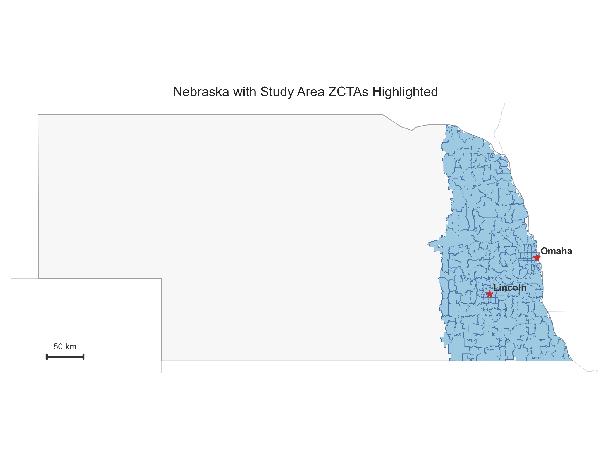
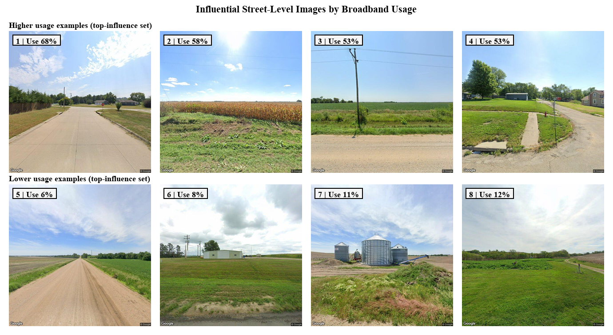
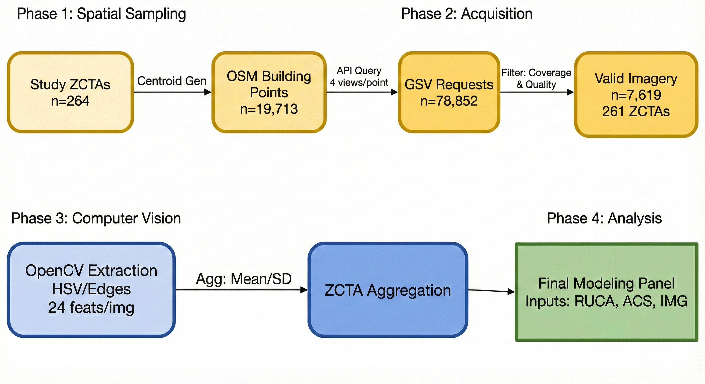
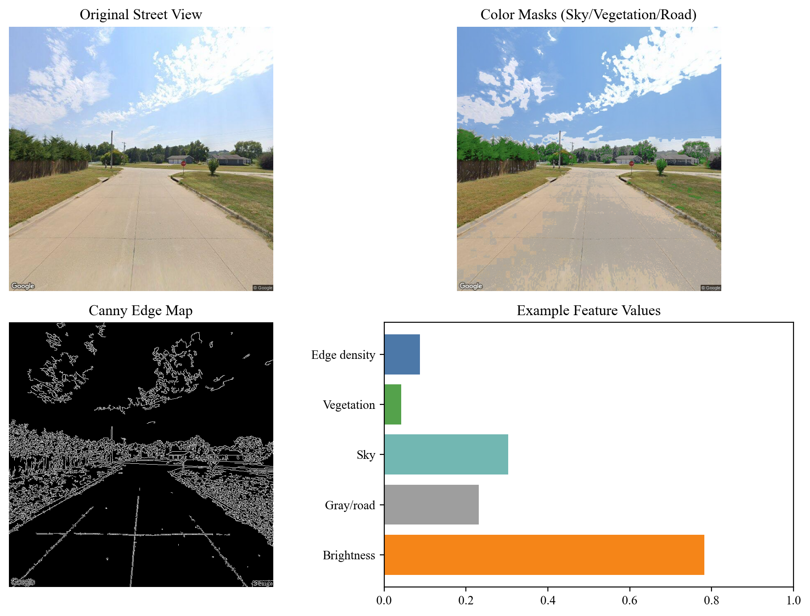
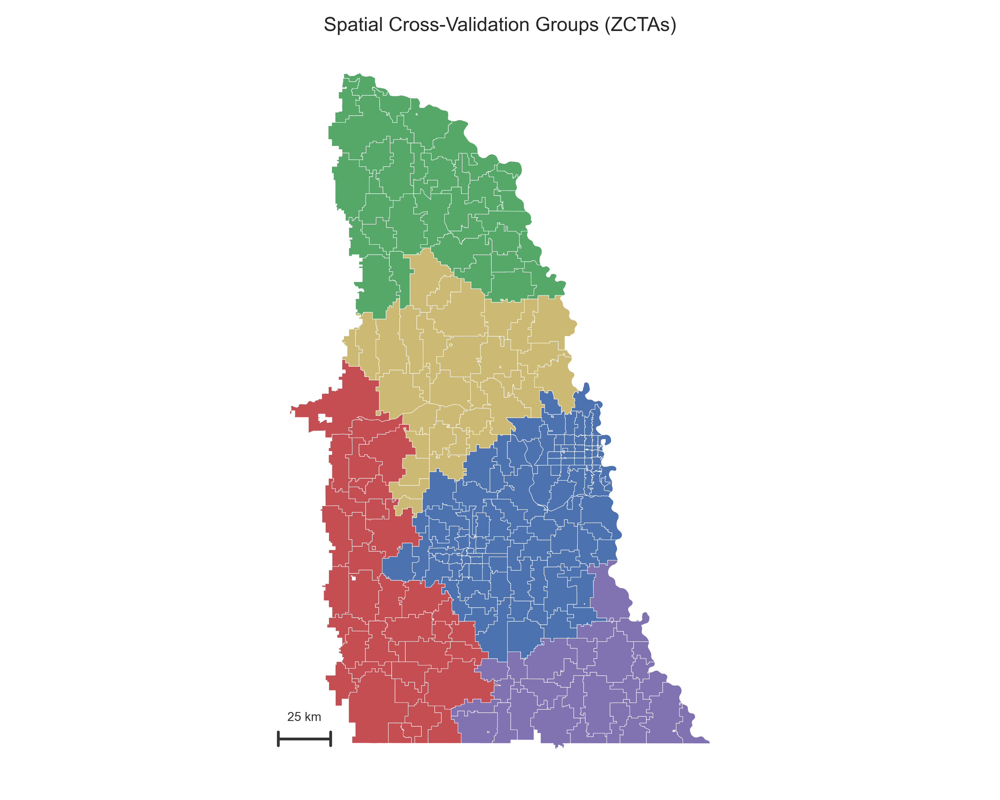
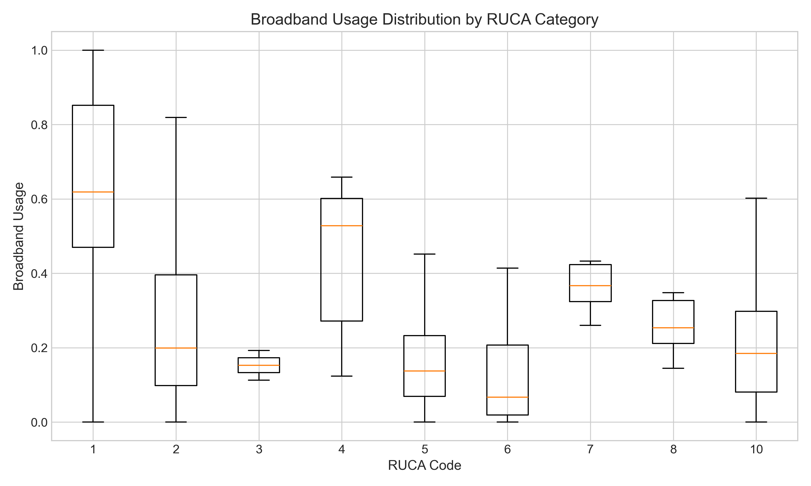
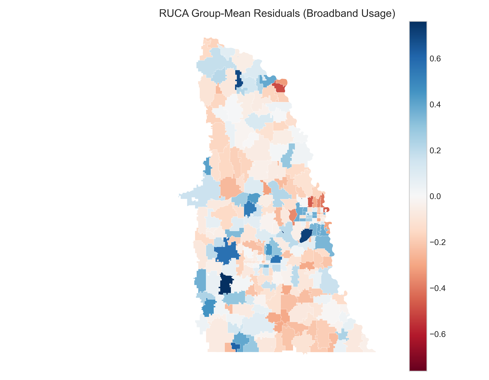

# Introduction

The persistence of the digital divide in the United States has largely transitioned from a problem of unknown scope to a problem of precise measurement. While the drivers of broadband adoption are known to differ substantially by geography—varying across dense urban cores, suburban peripheries, and sparse rural areas—policymakers continue to struggle with identifying exactly which communities remain underserved. This measurement gap is compounded by well-documented limitations in federal datasets: Federal Communications Commission (FCC) mapping data has historically overestimated rural availability, while crowdsourced alternatives like speed tests often suffer from selection biases that skew towards engaged, higher-income users.

In response to these data deficiencies, researchers and agencies have increasingly looked to novel methodologies to triangulate broadband access. Recent advances in machine learning and computer vision (CV) offer a potential "remote sensing" solution: the use of street-level imagery to automatedly assess the built environment. Theoretically, visual indicators—such as the presence of utility poles, the condition of paved roads, or the density of housing stock—could serve as scalable proxies for broadband infrastructure and adoption, allowing for lower-cost assessments than manual surveys or provider audits.

However, the application of these computationally intensive methods raises a critical question for public administration: do complex visual models actually outperform simple, readily available geographic typologies? Typologies such as the USDA's Rural-Urban Commuting Area (RUCA) codes have long provided a standardized proxy for the "character" of a place. If a simple administrative code can predict broadband usage with comparable accuracy to a computer vision model, the policy utility of investing in complex image analysis may be limited.

This study evaluates this trade-off by comparing the predictive power of street-level imagery against rural-urban typologies. We focus on 264 ZIP Code Tabulation Areas (ZCTAs) in eastern Nebraska, a region chosen for its distinct east-west gradient spanning metropolitan, suburban, and rural contexts. We extract 24 computer vision features—capturing attributes such as edge density, infrastructure complexity, and urban texture—from over 7,600 Google Street View images. These visual features are then benchmarked against RUCA-based models to predict broadband usage, defined here as the Microsoft-estimated share of residents achieving speeds of at least 25/3 Mbps.

Our analysis contributes to the literature on broadband measurement and algorithmic governance in three ways:

1. Methodological Benchmarking: We assess whether visual features provide incremental predictive value over "cheap" administrative baselines like RUCA codes.
2. Geographic Generalization: Using spatial cross-validation, we test the ability of these models to generalize to isolated geographic regions, simulating the real-world challenge of deploying a model to a new jurisdiction.
3. Policy Application: We frame the results not as definitive eligibility determinations, but as "screening signals" for prioritization and auditing, discussing how agencies might triangulate prediction errors with local evidence.

By rigorously comparing a novel computer vision approach against a standard typology, this study aims to inform a data-driven framework for broadband targeting—one that balances the promise of emerging technologies with the robustness of established geographic definitions.

# Literature Review

Reliable broadband access remains uneven across the United States, with rural areas consistently lagging behind their suburban and urban counterparts despite decades of public investment and regulatory reform [@ali2021farmfresh; @strover2014digital; @hollman2021rural]. While early explanations for this disparity focused primarily on infrastructure scarcity, contemporary scholarship frames the "rural digital divide" as a complex interaction among geography, market incentives, socioeconomic context, and policy design [@hollman2024a; @hollman2024b].

Addressing these disparities requires precise targeting, yet the field is currently hindered by a disconnect between the granularity of available data and the reality of rural infrastructure. Policymakers and researchers must navigate a landscape where the primary federal mapping systems systematically overstate availability, while alternative datasets suffer from significant selection biases [@gao2021broadband; @grubesic2015spatially; @major2020nowans; @saxon2022what]. This review summarizes the limitations of these existing measurement frameworks—specifically within the FCC and American Community Survey (ACS)—and examines how emerging methodologies, including computer vision and street-level imagery, are being proposed to fill this informational void [@gebru2017using; @liu2017place; @krell2023enabling]. Related work also uses typologies and GIS-based zoning to prioritize expansion areas, including LiDAR-derived vertical assets and parcel/address-fabric data [@kostelnick2024mapping; @gao2021broadband].

## The Challenge of Broadband Measurement

Effective policymaking depends on accurate coverage data, yet the Federal Communications Commission (FCC) has historically collected information at a resolution that obscures local gaps [@gao2021broadband; @grubesic2015spatially]. Research by Major et al. demonstrated that these maps frequently overstate availability and speeds in rural and minority communities [@major2020nowans]. Crowdsourced speed test datasets offer an alternative by characterizing on-the-ground performance, but they are socioeconomically biased toward engaged users [@saxon2022what]. Furthermore, while American Community Survey (ACS) estimates provide essential data on the adoption gap, they often diverge from infrastructure availability rates, complicating the distinction between lack of access and lack of adoption [@mejia2024computer; @asce2025reportcard].

## Policy and Funding Landscape

The Universal Service Fund (USF) and related high-cost programs have long been the principal federal tool for equalizing rural and urban service costs [@ali2021farmfresh; @americanconsumerinstitute2024usf]. Analysts note fiscal pressures and recent legal challenges over USF authority [@glass2021reforming; @harvardlawreview2025fcc; @supremecourt2025fcc]. USDA programs (Community Connect, ReConnect, and the broadband loan program) aim to expand infrastructure and improve speeds, with evidence of positive but uneven effects [@kandilov2017impact; @goldstein2025impacts]. Broader studies link rural broadband availability to economic outcomes such as business startup rates and growth [@deller2022rural; @whitacre2014broadband]. Disparities by race, income, and age persist in approved service areas [@pender2023three]. With the ACP ending on June 1, 2024 after Congress provided no additional funding [@usac2024acp; @crs2025acp], cost-effective targeting remains central to broadband policy. Evidence from the ACP shows uptake varies with eligibility and local context, underscoring demand-side constraints in subsidy programs [@horrigan2024acp].

## Emerging Methodological Innovations

Researchers have proposed CV, multimodal learning, and street-level imagery as complementary tools for measuring infrastructure and adoption patterns beyond traditional administrative datasets.

### Computer Vision and Street Imagery for Infrastructure Assessment

A critical barrier is the lack of detailed broadband infrastructure inventories. Providers self-report to the FCC Broadband Data Collection and may list planned infrastructure that is not yet deployed. Computer vision (CV) methods may offer a partial remedy. Prior work uses CNNs and satellite imagery to detect towers and other infrastructure [@krell2023enabling]. Civil engineering CV supports infrastructure inspection and defect detection [@koch2015review], and recent studies identify utility poles and power lines in aerial or UAV imagery [@gomes2020poles; @santos2024powerline; @faisal2025review]. Ground-level imagery studies show street view features can predict socioeconomic indicators and safety outcomes [@gebru2017using; @liu2017place]. Large-scale public health work links street features to health outcomes, but image quality and temporal variation can limit reliability [@nguyen2021leveraging; @egli2019viewing; @fan2025coverage].

### Integrating Social Science Data with Quantitative Results

Integrating broadband metrics with socioeconomic indicators and behavioral data remains an active area. Multimodal machine learning frameworks enable fusion of visual, textual, and numerical modalities [@baltrusaitis2018multimodal]. Recent work uses crowdsourced speed tests to examine measurement bias and internet inequality [@saxon2022what]. Behavioral and agent-based models study rural adoption dynamics [@agarwal2024adoption]. These approaches motivate evaluating whether street imagery adds predictive value to typology-based models.

## Exploring a New Method of Broadband Measurement

This literature motivates our study. Rural broadband availability and adoption lag behind urban counterparts despite substantial federal funding. Existing measurement approaches can be time-consuming and costly, and typologies of rurality vary in definition and policy relevance. CV and street imagery offer an alternative way to predict broadband usage in rural areas and merit evaluation. This study tests whether geographic typologies and visual indicators can forecast broadband usage and inform targeting. By evaluating which variables and analytic approaches are most predictive, this study contributes to a data-informed framework for identifying underserved communities and guiding broadband policy.

# Data and Methods

We predict broadband usage across 264 ZIP Code Tabulation Areas (ZCTAs) in eastern Nebraska, a state spanning urban, suburban, and rural contexts. We describe the study area definition, input features, target variable, and evaluation framework used for model training.

## Study Area Definition

Nebraska occupies the central Great Plains, with terrain transitioning from the Missouri River valley in the east to the semi-arid High Plains and Sandhills in the west. The state's population and economic activity concentrate along the eastern corridor: Omaha (population about 490,000) and Lincoln (about 295,000) anchor a metropolitan region that contains roughly half the state's residents. Moving westward, the landscape shifts from suburban development and irrigated cropland to dryland agriculture, ranching, and dispersed small towns. This east-west gradient provides variation across urban, suburban, and rural contexts for evaluating how visual and typological features relate to broadband usage.

The study sample includes 264 ZCTAs in Nebraska, representing about 50% of the state's roughly 530 ZCTAs. Selection was based on three criteria: (1) availability of Microsoft broadband usage labels, (2) valid RUCA codes from USDA, and (3) geographic concentration in the eastern portion of the state. The sample spans the full RUCA spectrum from metropolitan cores (Omaha, Lincoln) to remote rural areas, though it is geographically concentrated in the eastern half of Nebraska. This concentration reflects both population density, as most Nebraskans live in the eastern corridor, and data availability.

Of the 264 ZCTAs, Google Street View imagery is available for 261 (98.9%). The three ZCTAs without imagery are excluded from visual-only and combined models. For spatial cross-validation and modality comparisons, we restrict analyses to the 261 ZCTAs with imagery to keep samples aligned; the holdout tables use the fixed split on the full labeled sample for comparability with prior results. The study area and included ZCTAs are shown in @fig-study-area.

{#fig-study-area}

## Input Features

### Google Street View Imagery and Sampling

We link Google Street View (GSV) imagery to ZCTAs using a structured sampling protocol. For each ZCTA, we identify candidate sampling points from OpenStreetMap building centroids, ranked by building footprint area to prioritize larger structures (for example, commercial buildings, schools, and public facilities) that are more likely to have street-level coverage. From each candidate point, we request four images at cardinal headings (0°, 90°, 180°, 270°) using the GSV Static API at 640×640 pixel resolution. The API returns the nearest available panorama to each requested location; we do not constrain imagery dates, so temporal coverage varies by location, typically spanning 2018 to 2023.

Imagery is available for 261 ZCTAs, totaling 7,619 images (mean 29.2 per covered ZCTA; range 4-52). For modeling, we cap extraction at 10 images per ZCTA, selected alphabetically by filename for reproducibility. ZCTAs with fewer images contribute all available frames. Cap-sensitivity analyses using the visual-only ridge baseline show holdout R² values from -0.04 to -0.01 and contiguity-based spatial CV from -0.51 to -0.42 across 5, 10, 20, and all images; conclusions are unchanged.

Figure @fig-gsv-usage-examples provides representative street-level scenes from the diagnostic influential-image set. The numbered tiles (1-8) show examples associated with higher and lower broadband usage values, with each tile labeled by the corresponding ZCTA usage rate to make the contrast explicit.

{#fig-gsv-usage-examples}

### Data Pipeline Summary

We summarize the imagery pipeline with counts from the sampling manifest and diagnostic outputs. For the 264 study ZCTAs, we request up to 75 building centroids per ZCTA (mean 74.7; range 30 to 75) and four headings per centroid, totaling 19,713 points and 78,852 image requests. The retrieval step yields 7,619 images across 261 ZCTAs (98.9% coverage; mean 29.2 images per covered ZCTA). We extract 24 OpenCV features per image, aggregate to ZCTA-level means, and restrict spatial CV modality comparisons to the 261 ZCTAs with imagery. Figure @fig-data-pipeline summarizes the workflow.

{#fig-data-pipeline}

### Rural-Urban Typology Data

We use Rural-Urban Commuting Area (RUCA) codes as a proxy for urban-rural context. RUCA codes classify U.S. census tracts using measures of population density, urbanization, and commuting patterns, providing a standardized proxy for the character of a place. We use ZCTA-level RUCA codes from the U.S. Department of Agriculture [@usda2020ruca]. Each ZCTA is assigned primary (RUCA1) and secondary (RUCA2) codes. Robustness checks show RUCA2-only and RUCA1+RUCA2 variants yield only modest, high-variance gains under spatial CV, so the main models use RUCA1 for parsimony.

### Unit of Analysis and Policy Use Case

The unit of analysis is the ZCTA, which is coarser than the census-block or location-level resolution used in programs such as BEAD. We distinguish two policy use cases: (1) within-region screening for audit prioritization, where training and deployment areas overlap, and (2) cross-region transfer to new jurisdictions. The fixed holdout split corresponds to use case 1, while spatial CV approximates use case 2. In both cases, predictions are screening signals rather than eligibility determinations, so agencies should pair them with transparent criteria and an appeal process. Because ZCTAs can be spatially large and heterogeneous, predictions are not suitable for direct block-level targeting or for inferring causal policy levers.

### Visual Feature Engineering

To translate visual characteristics into quantifiable data, we extract a 24-feature OpenCV set from each image. The features capture edge density and orientation (vertical/horizontal), infrastructure and road proxies (infrastructure ratio, road/building/pole/wire density, pavement ratio), texture and structure (structure complexity, urban texture, development index, infrastructure continuity, built ratio, openness), and color/scene composition (brightness, saturation, color variance, vegetation/sky/gray ratios, hue diversity, contrast, colorfulness). Feature values are aggregated to the ZCTA level by averaging across images within each ZCTA.

We access publicly available GSV imagery through the Google Street View Static API in accordance with Google's terms of service. The analysis is conducted at the ZCTA level on aggregated features and does not attempt to identify individuals or private attributes; the study does not involve human subjects.

Figure @fig-gsv-feature-overlay illustrates how several of these features are operationalized in a single image, including edge density and color-based masks for sky, vegetation, and roadway surface.

{#fig-gsv-feature-overlay}

## Target Variable: Broadband Usage Data

For the target variable, we use the "U.S. Broadband Usage Percentages" dataset from Microsoft Research [@microsoft2020broadband]. This public dataset estimates broadband usage at the ZCTA level across the United States using Microsoft service and application telemetry. The target is the estimated percentage of the population within each ZCTA achieving speeds at or above 25/3 Mbps. We interpret this measure as a usage proxy rather than a direct measure of infrastructure availability. The telemetry may underrepresent populations with limited Microsoft usage or device access, and the file does not provide an explicit year field.

### Measurement Governance Considerations

Using private-sector telemetry as ground truth for broadband policy raises normative concerns. The Microsoft dataset reflects usage patterns of users with Microsoft devices, applications, and services, potentially underrepresenting households with limited device ownership, those using non-Microsoft platforms, or mobile-only users. Demographic groups less likely to own Windows computers or use Microsoft services may be systematically underrepresented. Throughout, the outcome should be interpreted as a usage proxy: low values may reflect infrastructure gaps, affordability, device access, digital skills, or telemetry bias.

We chose Microsoft telemetry over alternatives such as FCC Form 477/Broadband Data Collection, ACS self-reports, and Ookla speed tests because it provides granular ZCTA-level estimates of achieved speeds rather than advertised availability. FCC data historically overstate coverage; ACS questions ask about "internet access" without speed thresholds; speed tests are voluntary and skew toward engaged users.

For policy use, we recommend triangulating predictions from this model with local speed tests, community surveys, and provider availability data. The model is positioned as a screening tool to prioritize deeper audits rather than a definitive determination of need. In Appendix D, we define "underserved" as the bottom quintile of the usage proxy for ranking and triage, not as a formal eligibility cutoff. Errors in the underlying usage labels propagate to model predictions, so caution is warranted when using predictions for funding allocation.

## Modeling and Evaluation

We evaluate three feature configurations: (1) RUCA-only baselines using RUCA1, (2) visual-only models using the OpenCV feature set, and (3) combined models that include RUCA1 and the visual features. For each configuration, we compare linear regression, ElasticNet, and tree-based ensembles (Random Forest, Extra Trees, Gradient Boosting). Tree ensembles are tuned on the training split. Robustness checks report spatial cross-validation with nested tuning and diagnostics, including RUCA group-mean baselines, RUCA2 variants, late-fusion stacking, and block-level coefficient norms. Performance is assessed on a fixed 80/20 train-test split at the ZCTA level (random seed = 42) and reported using test $R^2$ as the primary metric, alongside RMSE and MAE (in proportion units; multiply by 100 for percentage points). Holdout tables use the fixed split on the full labeled sample (n = 264) from the precomputed feature set for comparability with prior results. All spatial CV comparisons (including RUCA baselines) use the imagery-available sample (n = 261) to avoid sample differences.

Within each cross-validation fold, feature standardization is fit on training data only and applied to the held-out fold to avoid leakage. The analysis uses the 24 OpenCV features only; no PCA or CNN embeddings are included.

### Spatial Cross-Validation Methodology

Standard random cross-validation can overestimate performance when observations are spatially autocorrelated; neighboring ZCTAs have similar broadband usage patterns, allowing models to leak information across folds. We use spatial cross-validation to enforce geographic separation between training and test sets.
This validation strategy simulates the practical administrative scenario of training a model in one jurisdiction (e.g., a pilot county) and deploying it to a neighboring region without ground-truth labels; failure in this metric indicates a high risk of misallocation if the model is scaled statewide.

Our canonical spatial CV uses queen contiguity clustering: we construct a connectivity graph where ZCTAs sharing any boundary (edge or vertex) are neighbors, then apply agglomerative clustering with Ward linkage to partition ZCTAs into five spatially contiguous groups. GroupKFold ensures each group is held out entirely during evaluation. This approach tests whether models can generalize to isolated geographic regions not seen during training, a conservative test relevant for deployment to new areas.

We also evaluate sensitivity to five alternative spatial partitioning schemes: k-means clustering on ZCTA centroids (creating compact spatial groups), balanced k-means with equal-size clusters, latitude bands (five north-south strips), longitude bands (five east-west strips), and spatial blocks (a 2D grid of roughly equal-area cells). These alternatives test different generalization scenarios. Nebraska's urban-rural gradient runs east to west (Omaha and Lincoln in the east, rural areas in the west), so longitude bands align with this gradient and allow models to extrapolate along the known urban-rural axis, a less conservative test than contiguity, which creates spatially isolated holdout regions.

The fold map for contiguity-based grouping is shown in @fig-spatial-groups. Fold sizes range from 31 to 87 ZCTAs with a mean of 52, reflecting substantial imbalance: Fold 1, covering the Omaha/Lincoln metro area, contains 87 ZCTAs, while the remaining folds contain 31 to 73 each. All five folds contain multiple RUCA categories, though the distribution varies substantially by fold, as detailed in Appendix C.

{#fig-spatial-groups}

# Results

Our analysis evaluated linear, ElasticNet, and ensemble models across RUCA-only, visual-only, and combined feature sets using a fixed holdout split. The results show a clear hierarchy: RUCA typology features remain the strongest predictors, while visual features capture a moderate signal that does not surpass the RUCA-only ensembles.

## Overall Model Performance

A comparison of all modeling approaches highlights the strength of RUCA-only ensembles and the limits of incremental gains from visual features. Table 1 reports baseline holdout metrics, while Table 2 reports tuned tree ensemble results on the same split.

**Table 1: Holdout Model Performance (Test $R^2$, RMSE, MAE)**

| Feature Set | Model | Test $R^2$ | RMSE | MAE |
| --- | --- | --- | --- | --- |
| RUCA only | Numeric (naive) | 0.144 | 0.270 | 0.216 |
| RUCA only | One-hot Ridge | 0.400 | 0.226 | 0.174 |
| RUCA only | Random Forest | 0.391 | 0.228 | 0.175 |
| RUCA only | Extra Trees | 0.392 | 0.228 | 0.175 |
| RUCA only | Gradient Boosting | 0.392 | 0.228 | 0.175 |
| Visual only | ElasticNet | 0.299 | 0.244 | 0.194 |
| Visual only | Extra Trees | 0.287 | 0.247 | 0.192 |
| Visual only | Random Forest | 0.230 | 0.256 | 0.203 |
| Visual only | Gradient Boosting | 0.231 | 0.256 | 0.203 |
| Combined | ElasticNet | 0.299 | 0.244 | 0.194 |
| Combined | Extra Trees | 0.279 | 0.248 | 0.194 |
| Combined | Random Forest | 0.228 | 0.257 | 0.202 |
| Combined | Gradient Boosting | 0.251 | 0.253 | 0.201 |

**Table 2: Tuned Tree Ensemble Performance (Test $R^2$, RMSE, MAE)**

| Feature Set | Model | Test $R^2$ | RMSE | MAE |
| --- | --- | --- | --- | --- |
| RUCA only | Random Forest (tuned) | 0.410 | 0.224 | 0.169 |
| RUCA only | Extra Trees (tuned) | 0.392 | 0.228 | 0.175 |
| RUCA only | Gradient Boosting (tuned) | 0.391 | 0.228 | 0.175 |
| Visual only | Random Forest (tuned) | 0.293 | 0.245 | 0.197 |
| Visual only | Extra Trees (tuned) | 0.373 | 0.231 | 0.180 |
| Visual only | Gradient Boosting (tuned) | 0.294 | 0.245 | 0.196 |
| Combined | Random Forest (tuned) | 0.326 | 0.240 | 0.193 |
| Combined | Extra Trees (tuned) | 0.376 | 0.231 | 0.180 |
| Combined | Gradient Boosting (tuned) | 0.291 | 0.246 | 0.196 |

*Note: Holdout metrics use the fixed split on the full labeled sample (N = 264) from the precomputed feature set. RMSE/MAE are in proportion units; multiply by 100 to interpret as percentage points.*

## The Predictive Power of Rural-Urban Typology

RUCA alone remains a strong predictor. A naive numeric RUCA baseline achieves an R² of 0.144, but a one-hot RUCA ridge model reaches 0.400 and the tuned Random Forest reaches 0.410 on the holdout split. Under contiguity-based spatial CV, a simple RUCA group-mean baseline yields R² = -0.05 ± 0.29, similar to the categorical ridge (-0.04 ± 0.27). The broadband usage distribution by RUCA category and the corresponding residual map highlight where RUCA alone systematically under- or over-predicts, as shown in @fig-broadband-by-ruca-boxplot and @fig-ruca-residual-map.

## Comparison with ACS Socioeconomic Baseline

To test whether RUCA is truly the best "cheap baseline," we compare it to American Community Survey (ACS) socioeconomic features: median household income, percent age 65+, percent with bachelor's degree or higher, percent owner-occupied housing, and log population. Under contiguity-based spatial CV, ACS-only achieves R² = -0.05 ± 0.34, slightly below RUCA categorical (-0.01 ± 0.27 on the ACS-complete sample). Combining ACS with RUCA does not improve performance (-0.03 ± 0.29). Although ACS features add context, neither baseline achieves positive R² under the most conservative spatial validation, indicating that all "cheap" predictors struggle to extrapolate to isolated geographic regions. Full ACS comparison results are reported in Appendix B.

On the fixed holdout split restricted to ZCTAs with complete ACS data (N = 258), RUCA categorical reaches R² = 0.25, ACS-only reaches 0.06, and RUCA+ACS reaches 0.13 (Table B2). These holdout results reinforce that ACS features do not outperform RUCA within-region and add limited incremental signal in this sample.

{#fig-broadband-by-ruca-boxplot}

{#fig-ruca-residual-map}

## The Limited Contribution of Visual Features

In contrast to the typology data, visual features show a moderate but weaker signal. Tuning improves the best visual-only model (Extra Trees) to $R^2$ = 0.37 on the holdout split, but this remains below the RUCA-only baselines. Under contiguity-based spatial CV, visual-only models show negative R² values with high variance (-0.49 ± 0.56), indicating limited geographic generalization. These results indicate that visual cues carry signal about broadband usage, but the signal remains weaker than RUCA.

A cap-sensitivity check using the visual ridge baseline shows holdout R² values between -0.04 and -0.01 and spatial CV values between -0.51 and -0.42 across 5, 10, 20, and all images (Table E1). This stability suggests the spatial CV collapse is not driven by undersampling images per ZCTA.

## Combined Model Performance

Combined models do not outperform the RUCA-only baselines. The best combined specification (tuned Extra Trees) reaches $R^2$ = 0.38 on the holdout split, remaining below the RUCA-only one-hot ridge (0.40) and tuned Random Forest (0.41). A late-fusion (stacked) model yields R² = -0.08 ± 0.29 under spatial CV, and block-level coefficient norms show the RUCA block dominates (L2: 0.41 vs 0.09 for the visual block). This pattern suggests that typology dominates performance and that visual features offer limited incremental gains when fused with RUCA.

## Model Validation

All results in Tables 1 and 2 use the same fixed holdout split to ensure comparability across feature sets and model classes. Contiguity-based spatial cross-validation with nested tuning yields substantially lower R² values: RUCA categorical ridge -0.06 ± 0.27, RUCA group-mean baseline -0.05 ± 0.29, and tuned Random Forest -0.04 ± 0.27. Adding RUCA2 yields only a modest, noisy improvement (RUCA1+RUCA2 categorical 0.01 ± 0.21). Visual-only models remain negative under spatial CV (-0.49 ± 0.56), and combined models are modest at best (tuned one-stage Extra Trees -0.19 ± 0.33; tuned two-stage -0.26 ± 0.35; late fusion -0.08 ± 0.29).

Coordinates-only baselines perform poorly: a lat/long ridge model yields holdout R² = -0.03 and contiguity spatial CV R² = -1.50 ± 1.36 (longitude-only: -0.80 ± 1.15). These results indicate that simple spatial trend features do not explain the observed signal (Table E2).

### Sensitivity to Spatial Grouping Method

Spatial CV estimates depend substantially on how geographic folds are defined. RUCA categorical R² ranges from -0.18 (balanced k-means) to 0.22 (longitude bands), while the combined two-stage model ranges from -0.58 (balanced k-means) to 0.03 (longitude bands). This variation reflects Nebraska's east-west urban-rural gradient: longitude bands allow models to extrapolate along this known axis, while contiguity-based folds test harder "isolated region" scenarios where models must generalize to areas surrounded by training data but held out entirely.

We treat contiguity-based folds as canonical because they represent the more conservative deployment scenario---predicting to a new geographic region with limited nearby training data. The positive R² values under longitude bands indicate that RUCA typology successfully captures the east-west gradient, but this may overstate real-world performance if models are deployed to regions with different spatial structure.

### Late-Fusion Stacking Approach

The late-fusion model fits RUCA-only and visual-only base learners separately, then stacks their predictions using a ridge meta-learner. To avoid leakage, base learner predictions on the training fold are generated via cross-validation before fitting the meta-learner. This approach allows each feature block to use its optimal regularization---α=1 for RUCA and α=100 for visual---while learning an optimal combination weight. Block-level coefficient norms confirm the RUCA block dominates (L2: 0.41 vs 0.09 for visual), indicating that typology drives most of the predictive signal.

## Reproducibility and Data Availability

All reported metrics are computed from the analyses described above. Hyperparameter grids and software versions are reported below to support reproducibility.

Reproducibility details are summarized in Table R1. Table R1 reports the cross-validation configuration and spatial sensitivity groupings. Hyperparameter grids are reported in Appendix F (Table F1).

**Table R1: Cross-validation configuration**

| Item | Value |
| --- | --- |
| Spatial CV (canonical) | 5 geographic groups via contiguity-constrained clustering of ZCTA polygons (queen); GroupKFold |
| Repeated CV | 5 splits with 10 repeats |
| Nested tuning | 3 inner folds |
| Sensitivity groupings | k-means, balanced k-means, latitude bands, longitude bands, spatial blocks |

The OpenCV feature set includes 24 variables: edge_density, vertical_density, horizontal_density, infrastructure_ratio, road_density, building_density, pole_density, wire_density, pavement_ratio, structure_complexity, urban_texture, development_index, infrastructure_continuity, built_ratio, openness, brightness, saturation, color_variance, vegetation_ratio, sky_ratio, gray_ratio, hue_diversity, contrast, and colorfulness.

Raw GSV imagery is subject to Google terms of service and cannot be redistributed; derived ZCTA-level feature aggregates and model outputs can be shared. The broadband usage labels are from Microsoft Research's U.S. Broadband Usage Percentages dataset.

# Discussion

This study offers clear insights into modeling strategy for digital divide research. The strongest holdout performance comes from tuned models with proper categorical encoding of a simple geographic typology: RUCA-only models reach $R^2$ around 0.40, while visual features reach $R^2$ around 0.37 and do not improve on the RUCA baseline when combined. These results are predictive rather than causal; they support measurement and targeting use cases, not claims about policy levers. This hierarchy indicates that typology remains the most reliable signal in this setting, even when augmented with richer visual representations.

From a governance perspective, the key risk is overinterpreting optimistic splits. Agencies should report spatial CV schemes alongside holdout results, publish error rates for the intended deployment scenario, and provide a transparent process for communities to contest rankings or supply supplemental evidence.

## Limits of Street-Level Visual Signal

Street-level imagery provides a measurable but limited signal. Visual-only models reach $R^2$ around 0.37 after tuning, indicating that the built environment conveys information about broadband usage, but the signal does not surpass the typology baseline. The gap likely reflects visual homogeneity across much of Nebraska and the difficulty of inferring infrastructure quality from facades alone. Poles, ducts, and cabinets are often visible, but distinguishing legacy copper from modern fiber is challenging from street-level imagery. With a cap of 10 images per ZCTA, the visual signal remains constrained and may underrepresent within-ZCTA variation. These factors limit the incremental value of the visual features in this region.

## Administrative Implications: Benchmarking "Black Box" Solutions

The inability of the computer vision models to outperform simple RUCA typologies highlights a critical procurement challenge for broadband agencies. As federal programs like BEAD increasingly permit the use of alternative data sources to challenge federal maps, agencies will likely face vendors offering proprietary "AI-driven" coverage layers. Our findings suggest that complex models should not be assumed superior to low-cost administrative data.

From a governance perspective, this necessitates a "benchmark first" standard. Before acquiring or deploying novel predictive models, agencies should require performance comparisons against open, baseline typologies (like RUCA or ACS) using rigorous spatial cross-validation. If a sophisticated model cannot demonstrate incremental predictive value over these free public datasets in a held-out geographic region, its utility for allocating public funds is questionable. This "cheap baseline" test serves as a vital check against administrative bloat and algorithmic opacity.

## Implications for Future Research

Although the models did not perform as intended, this work points to a clear path for future research. Investigators should first maximize the predictive power of foundational, readily available datasets like geographic typologies through nonlinear ensemble methods. This approach is computationally and cost-effective and, as we have shown, can yield strong results. Only after exhausting the potential of such data should researchers consider more complex and computationally expensive sources. Our findings suggest a shift in focus may be warranted: satellite or aerial imagery may prove more effective than street-level imagery. Satellite data capture land-use patterns, building density, vegetation cover, and transportation networks that may correlate more strongly with the rural-urban spectrum and infrastructure deployment patterns. Analyzing the broader spatial environment of a location, rather than the facade of its buildings, is likely a more robust method for differentiating between areas in a visually homogeneous region like Nebraska. Overall, the study serves as a case study in modeling strategy. It shows that model choice and the ability to capture nonlinearities in existing data can matter more than adding modalities. The value of visual data is context-dependent; assumptions that hold in one setting may not transfer without validation. By prioritizing nonlinear analysis of foundational data, researchers can build strong, efficient models to help bridge the digital divide.

## Study Limitations

While this analysis offers clear guidance on the hierarchy of predictive features, several limitations constrain the generalizability of our results. First, the study sample is modest (N = 264 ZCTAs) and geographically concentrated in eastern Nebraska. This region represents a specific visual environment--the transition from Great Plains metropolitan areas to agricultural rurality--which may not fully reflect the visual heterogeneity found in mountainous, coastal, or heavily forested regions. Consequently, the "limits of visual signal" observed here should be validated in diverse geographies before ruling out street-level imagery entirely.

Second, our target variable is a usage proxy derived from private-sector telemetry rather than a direct engineering measure of infrastructure availability. While we selected Microsoft data to avoid the known biases of FCC availability maps, this usage metric may underrepresent households with limited device access or those using non-Microsoft platforms, conflating infrastructure gaps with adoption barriers. Policy interpretations should therefore treat our model outputs as screening signals for potential underservice rather than definitive proof of unserved status.

Finally, the study faces temporal and spatial alignment challenges inherent to multi-source data fusion. Our RUCA codes date from 2010, while the imagery spans 2018--2023, and the usage estimates lack an explicit vintage. Furthermore, despite the use of spatial cross-validation, the near-zero $R^2$ values in the contiguity-based tests suggest that spatial dependence remains a challenge. Future iterations would benefit from larger regional samples and end-to-end image models rather than the handcrafted OpenCV features used here, which may have failed to capture more subtle visual cues of infrastructure quality.

# Conclusion

This study evaluates whether street-level imagery improves prediction of broadband usage beyond a rural-urban typology across Nebraska ZCTAs. RUCA-based models provide the strongest performance on the fixed holdout split (R² = 0.40), while OpenCV visual features add a modest signal that does not surpass the typology baseline. However, spatial cross-validation indicates limited cross-regional generalization: policy-relevant metrics show only modest ranking performance (Spearman ρ = 0.40) and limited triage precision (Precision@20% = 0.21). RUCA-based screening is appropriate within characterized regions but should not be deployed to new areas without local validation. Future work should prioritize stronger spatial validation, larger regional samples, and alternative imagery sources or feature representations to determine when visual signals meaningfully improve broadband measurement.

# References {.unnumbered}

::: {#refs}
:::

# Appendix A: Spatial CV Sensitivity {.unnumbered}

Table A1 summarizes spatial cross-validation performance across alternative spatial grouping definitions (mean ± SD R²). Contiguity-based folds (queen) are the canonical specification; coordinate-based methods are provided for sensitivity.

**Table A1: Spatial CV sensitivity by grouping definition (mean ± SD R²)**

| Spatial grouping | RUCA categorical | RUCA1+RUCA2 categorical | RUCA group-mean | Combined two-stage | Late fusion |
| --- | --- | --- | --- | --- | --- |
| Contiguity (queen) | -0.04 ± 0.27 | 0.01 ± 0.21 | -0.05 ± 0.29 | -0.26 ± 0.35 | -0.08 ± 0.29 |
| K-means (centroids) | -0.07 ± 0.29 | -0.03 ± 0.24 | -0.09 ± 0.31 | -0.27 ± 0.42 | -0.13 ± 0.36 |
| Balanced k-means | -0.18 ± 0.37 | -0.15 ± 0.31 | -0.19 ± 0.38 | -0.58 ± 0.72 | -0.25 ± 0.46 |
| Latitude bands | 0.12 ± 0.20 | 0.13 ± 0.18 | 0.11 ± 0.22 | -0.10 ± 0.22 | 0.08 ± 0.21 |
| Longitude bands | 0.22 ± 0.21 | 0.24 ± 0.20 | 0.22 ± 0.21 | 0.03 ± 0.22 | 0.21 ± 0.18 |
| Spatial blocks | 0.11 ± 0.26 | 0.10 ± 0.32 | 0.10 ± 0.28 | -0.04 ± 0.22 | 0.10 ± 0.22 |

*Note: Longitude bands align with Nebraska's east-west urban-rural gradient (Omaha/Lincoln in east, rural west), explaining the stronger generalization. Contiguity-based folds test harder "isolated region" scenarios.*

# Appendix B: ACS Baseline Comparison {.unnumbered}

Table B1 compares RUCA typology to American Community Survey (ACS) socioeconomic features under contiguity-based spatial CV. ACS features include median household income, percent age 65+, percent with bachelor's degree or higher, percent owner-occupied housing, and log population.

**Table B1: RUCA vs. ACS baseline comparison (contiguity-queen spatial CV)**

| Model | R² (mean ± SD) | N features |
| --- | --- | --- |
| RUCA categorical | -0.01 ± 0.27 | 1 (10 categories) |
| ACS-only | -0.05 ± 0.34 | 5 |
| ACS + RUCA | -0.03 ± 0.29 | 6 |

*Note: RUCA slightly outperforms ACS under spatial CV, but neither achieves positive R², indicating limited geographic generalization for all "cheap" baselines.*

**Table B2: RUCA vs. ACS baseline comparison (fixed holdout, ACS-complete subset)**

| Model | Test $R^2$ | RMSE | MAE | N |
| --- | --- | --- | --- | --- |
| RUCA categorical | 0.250 | 0.259 | 0.195 | 258 |
| ACS-only | 0.062 | 0.290 | 0.210 | 258 |
| ACS + RUCA | 0.127 | 0.280 | 0.197 | 258 |

*Note: Holdout metrics use the fixed split and the ACS-complete subset (N = 258). RMSE/MAE are in proportion units.*

# Appendix C: Spatial CV Fold Composition {.unnumbered}

Table C1 summarizes fold composition and RUCA categorical ridge performance under contiguity-based (queen) grouping. Fold sizes range from 31 to 87 ZCTAs, with substantial imbalance due to the geographic distribution of ZCTAs.

**Table C1: Fold composition and performance for contiguity-based spatial CV**

| Fold | N ZCTAs | Broadband (mean ± SD) | Pred mean | Bias (pred-true) | $R^2$ | Metro (1-3) | Micro (4-6) | Small Town (7-9) | Rural (10) |
| --- | --- | --- | --- | --- | --- | --- | --- | --- | --- |
| 1 | 87 | 0.44 ± 0.33 | 0.44 | 0.00 | 0.31 | 81 | 0 | 1 | 5 |
| 2 | 37 | 0.27 ± 0.21 | 0.28 | 0.01 | -0.23 | 10 | 2 | 1 | 24 |
| 3 | 73 | 0.41 ± 0.26 | 0.32 | -0.08 | 0.13 | 35 | 6 | 6 | 26 |
| 4 | 31 | 0.16 ± 0.16 | 0.27 | 0.12 | -0.45 | 3 | 4 | 7 | 17 |
| 5 | 33 | 0.26 ± 0.23 | 0.28 | 0.02 | 0.05 | 6 | 9 | 3 | 15 |

*Note: Fold-level $R^2$ values are for the RUCA categorical ridge model. Fold 1 contains 81 of 135 metropolitan ZCTAs (Omaha/Lincoln area), creating substantial RUCA imbalance across folds. When Fold 3 is held out, the model underpredicts that relatively high-usage fold (bias -0.08). When rural-heavy Fold 4 is held out, training data skews metro-heavy, leading to overprediction (bias 0.12). This imbalance is inherent to contiguity-based clustering of eastern Nebraska's geography and tests the scenario of deploying to a spatially distinct region.*

# Appendix D: Policy-Relevant Evaluation Metrics {.unnumbered}

Beyond R², we evaluate metrics relevant for policy use cases: ranking ability, precision in identifying underserved areas, and classification accuracy. Here, "underserved" refers to the bottom quintile of the usage proxy and is used as a triage threshold, not an eligibility rule.

**Table D1: Policy-relevant metrics for RUCA categorical model (contiguity-queen spatial CV)**

| Metric | Value | Interpretation |
| --- | --- | --- |
| Spearman ρ | 0.40 | Modest positive rank correlation between predicted and actual |
| Precision@20% | 0.21 | 21% of ZCTAs predicted in bottom quintile are truly underserved |
| Recall@20% | 0.21 | 21% of truly underserved ZCTAs correctly identified |
| Sensitivity (< median) | 0.45 | 45% of below-median ZCTAs correctly flagged |
| Specificity (< median) | 0.76 | 76% of above-median ZCTAs correctly excluded |

*Note: Under contiguity-based spatial CV, RUCA category means learned from training data transfer imperfectly to geographically distinct test folds. The positive Spearman correlation (0.40) indicates modest ranking ability, but Precision@20% remains low at 0.21. These metrics apply specifically to cross-regional deployment; within-region applications (fixed holdout) show R² = 0.40.*

Interpretation: The fixed holdout split represents within-region screening (R² = 0.40), while spatial CV represents cross-region transfer (R² = -0.04; Spearman ρ = 0.40), where ranking ability is modest and triage precision is weak. Policy implication: RUCA-based screening is appropriate within a characterized region (for example, prioritizing audits in eastern Nebraska) but is not appropriate for generalizing predictions to new states or regions without local validation.

# Appendix E: Image-Count Sensitivity and Coordinate Baselines {.unnumbered}

Table E1 summarizes the visual-only ridge baseline under different image caps per ZCTA, reporting holdout test $R^2$ alongside contiguity-based spatial CV mean ± SD. The performance is stable across caps, indicating that image undersampling is not driving the negative spatial CV results.

**Table E1: Image-count sensitivity for visual-only ridge baseline**

| Max images per ZCTA | Holdout test $R^2$ | Spatial CV $R^2$ (mean ± SD) |
| --- | --- | --- |
| 5 | -0.029 | -0.511 ± 0.581 |
| 10 | -0.006 | -0.485 ± 0.565 |
| 20 | -0.041 | -0.451 ± 0.533 |
| All | -0.034 | -0.424 ± 0.511 |

Table E2 reports coordinate-only baselines using latitude/longitude features. These models perform poorly on both the holdout split and contiguity-based spatial CV, indicating that simple spatial trends alone do not explain the observed signal.

**Table E2: Coordinate-only baselines**

| Model | Holdout test $R^2$ | Spatial CV $R^2$ (mean ± SD) |
| --- | --- | --- |
| Latitude + longitude (ridge) | -0.027 | -1.50 ± 1.36 |
| Longitude only (ridge) | -0.034 | -0.80 ± 1.15 |

# Appendix F: Hyperparameter Grids {.unnumbered}

Table F1 documents the hyperparameter search space used for all tuned models. Unless otherwise noted, defaults outside these grids follow scikit-learn defaults.

**Table F1: Hyperparameter grids**

| Model | Grid |
| --- | --- |
| Ridge | alpha: 0.1, 1, 10, 100 |
| ElasticNet | alpha: 0.01, 0.1, 1, 10; l1_ratio: 0.1, 0.5, 0.9 |
| Random Forest / Extra Trees | n_estimators: 200; max_depth: None, 10; min_samples_leaf: 1, 5; max_features: sqrt, 0.5 |
| Gradient Boosting | n_estimators: 100, 300; learning_rate: 0.05, 0.1; max_depth: 2, 3; subsample: 1.0, 0.8 |
